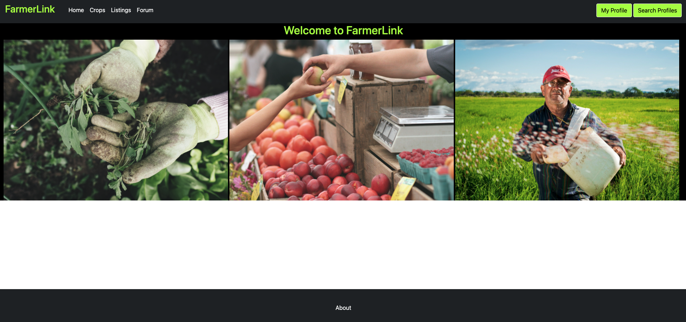
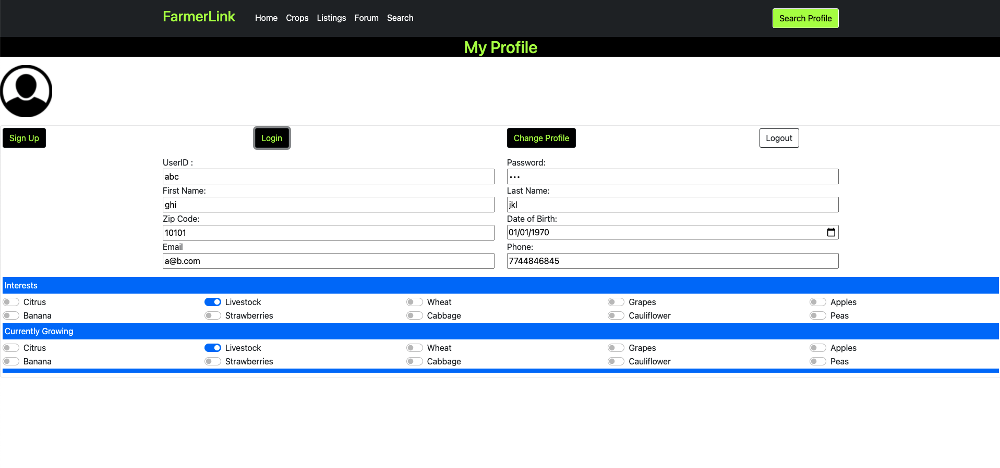
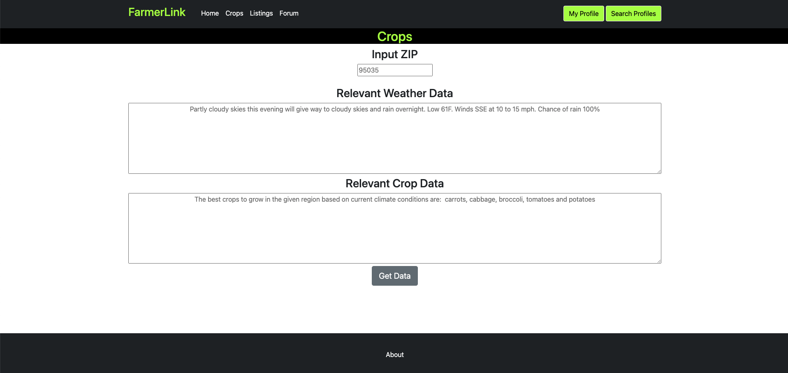
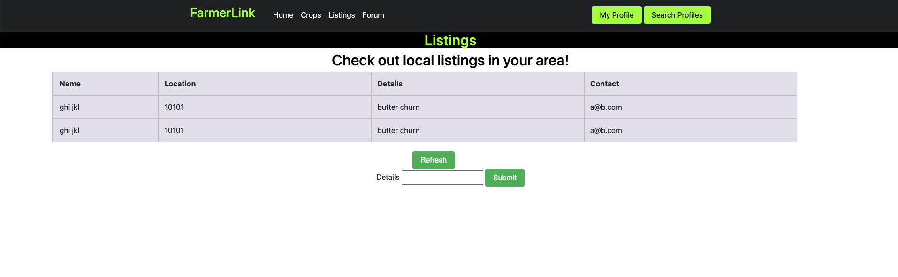
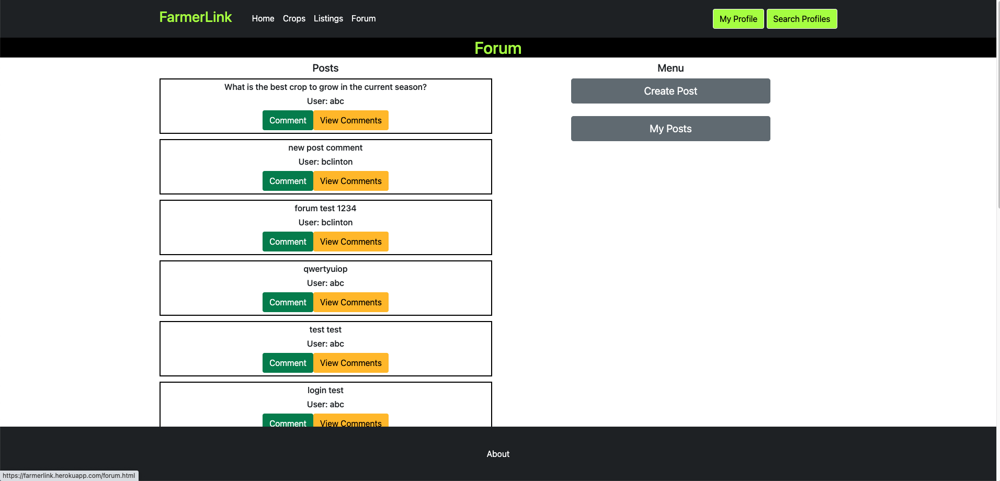

# Link: https://farmerlink.herokuapp.com/

# Team Aleph

## FarmerLink: Link with Farmers!

## Semester: Fall 2021

## Overview

Our application is a multipurpose utility program for farmers to use to connect to other farmers in their area, view their produce, view average produce prices in their area, and more. It will allow farmers to manage their farm-related tasks and is more oriented towards smaller-scale farmers.
Currently, there are applications for farmers to manage specific things such as water or electricity usage. However, our application will cater specifically to linking small business-owners for the purpose of facilitating farmers’ markets.

## Team Members

Sid: sid2033
Zach: ztower-umass 
Vidya: vidyago, nmn111

## User Interface

| Interface | Description | Image |
|-----------|-------------|-------|
| Landing | Basic landing page that users will see first. Presents relevant visuals to users. | 
| Profile | Displays information about current user. Also where user can log in / sign up for an account. | 
| Crops   | Displays crop data and weather data for a certain ZIP code. | 
| Listings| Displays all listings (i.e. local sales, etc.). Also supports user submitting their own listing. | 
| Forum | Displays all current forum posts. Has interface for user to make posts / comments, etc. | 
| User search | Search engine to look up site users | 

## API Endpoints
Endpoints with description:

'/forum/getPostData'

* GET request
* Used to retrieve all posts and their relevant data on page load/after adding a new post to refresh feed

'/forum/addComment'

* POST request
* Used to add a comment to a specific post
* POST data will have data such as the name of the comment and the user posting it

'/forum/upvote' AND '/forum/downvote'

* POST request
* Used to Upvoted/Downvote a specific post
* POST data will have the post’s information so it can be modified accordingly

'/forum/getCommentforPost'

* POST request
* Used to retrieve all comments for a specific post
* POST data will have the post’s information so it’s relevant comments can be retrieved

'/forum/makePost'

* POST request
* Used to add a post to the server made by the current user
* POST data will have all the post’s relevant information and the user making it

'/forum/myPosts'

* POST request
* Used to retrieve all posts made by the current user
* POST data will have the current user’s username so their respective posts can be retrieved

'/crops/getCropWeatherData'

* POST request
* Used to retrieve the relevant crop and weather data for the specified inputs
* POST data will take the zip code and/or region entered by the user 

'/user/getUserData'

* GET request
* Retrieves user data based off query data
* Returns JSON of user data, password, user firstname and lastname

'users/getUserDetail'

* POST request
* Retrieves details to user profile, such as DOB and email
* Returns 200 and JSON with appropriate fields

'users/addUserDetail'

* POST request
* Assigns details to user profile, such as DOB and email
* Returns status message (i.e. "success", "sorry, pick another user ID")

'listings/addListing'

* POST request
* Adds listing data to database
* Returns 200 message with name field

'listings/getListings'

* GET request
* returns a list of length n with JSON objects representing field data
* Involked with Refresh button

## URL Table

| Interface | URL | Authentication |
|-----------|-------------|-------|
| Landing | /index.html | 
| Profile | /userPage.html | 
| Crops   | /crops.html | Login needed to view page
| Listings| /listings.html | Login needed to view page
| Forum | /forum.html | Login needed to view page
| User search | /search.html |

## Authentication

All user authentication happens via the Profile interface. For a registered user, they may log in via filling out the username and password fields and clicking the "Login" button above. At this point, the remaining fields (i.e. First name, last name, etc.) should populate the other boxes on the page. Username and password are then stored securely in session using a OAuth passport. Password hashes are stored via a SQL database, along with salts.

## Division of Labor

### Milestone 0: All brainstorming was mutual

### Milestone 1
* Vidya: user.html, search.html, index.html
* Sid: forum.html, crops.html, template.html
* Zach: listings.html, milestone1.md, diagrams

### Milestone 2
* All
    * Implement JS APIs for each teammate’s own page
    * Collect screenshots for milestone2.md
* Sid
    * API Outline 
    * Forum and Thread API
    * Crop query
* Vidya
    * User profile fetch
    * User search feature
* Zach
    * Listings
    * milestone2.md
    * setup.md
    * Heroku deployment

### Milestone 3
* Sid
    * Forum Page
        * Forum page UI integration
        * Forum page API/backend integration
        * Comment SQL Table
        * Post SQL Table
    * Crop Page
        * Crop page UI integration
        * Crop weather API/backend integration
        * Crop choice logic integration
    * 1/2 documentation (i.e. final.md, setup.md, milestone3.md)
 * Zach
    * Listings page
        * Listing UI integration
        * Database integration
    * Authentication refining
        * Authentication persistence implementation
        * Login*only page access implementation
    * 1/2 documentation (i.e. final.md, setup.md, milestone3.md)
 * Vidya
    * Postgres Heroku Add-on configuration
    * User Page
        * User authentication, backend + interface
        * User add, modify, backend+interface
        * Client-side valdation
    * Search Page
        * Search users based on search criteria
        * UI, backend, database integration
        * Shows search results
    * Storage of user details

### Final Milestone

* Zach
    * Write up final.md
    * Make final video cut in iMovie
    * Upload video to YouTube
    * Polishing listings page
* Vidya
    * Homepage polishing
    * Slideshow working, if possible
    * Homepage body
    * Polishing other pages (user login, user search)
* Sid
    * Fix page footer (“about”) — too big
    * Cleaned up Forum and Crop interface
    * Flush DB
    * Add favicon.ico
* Everyone
    * Make video introduction IRL
    * Make video showcasing and explaining the FarmerLink feature you implemented
    * Write up rubric

## Conclusions

Generally speaking, the team was very successful in creating a viable working product for the given timeline. We had great luck working with Bootstrap, getting our SQL database to work, and working with the native Heroku deployment environment. Overall, we had very few blockers that completely halted our progress with the project.

After reviewing our finished product for the app, our team is generally satisfied with the app interface and functionality. Indeed, there are likely areas where more time could be devoted to create a better app. Namely, our team would have liked to reworked the login UI experience to make it more user-friendly. 

Overall, we feel as though we have completed the project entirely and are satisfied with the finished product.

