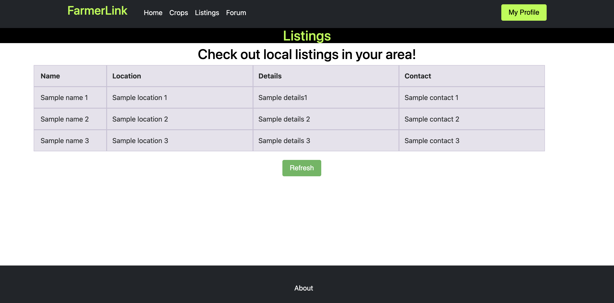
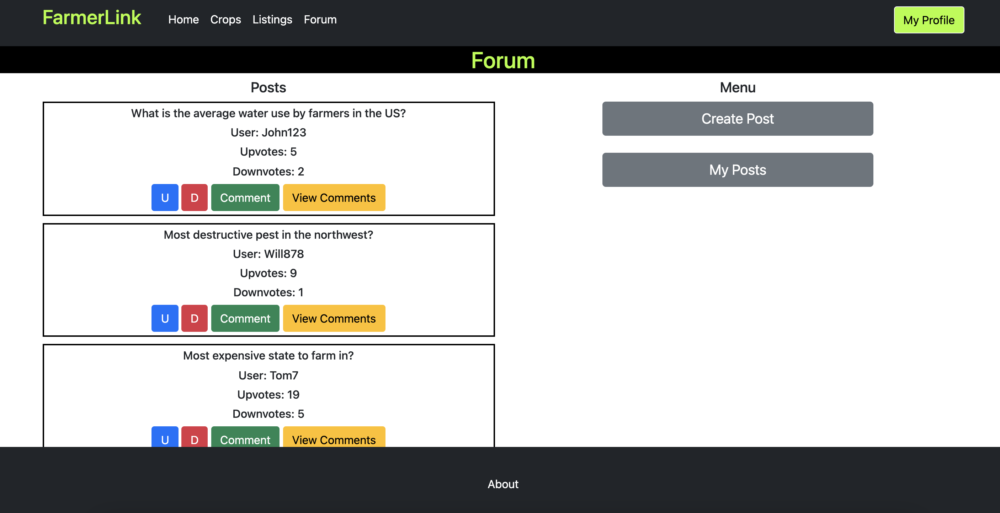

# Milestone 1: FamerLink

## Project Details

## Team name: Team Aleph

## Team members:
* Zachary Tower, Github ztower-umass 
* Vidya Gopal, Github vidyago, nmn111
* Siddharth Raju, Github sid2033

## Division of Labor
* Vidya: user.html, search.html, index.html
* Sid: forum.html, crops.html, template.html
* Zach: listings.html, milestone1.md, diagrams

## Data Interactions

FarmerLink is a multipurposed site with a number of data interactions.

* The most straightforward data interaction is some of the auxiliary services, such as the crop data served by crops.html and listing data served in listings.html. Data interaction on the crops page simply involves the user inputting a ZIP code, which is served to a weather API and then delivers some crop-relevant weather data. It also will deliver some miscellaneous data about crop harvesting in the area. 

* listings.html will simply display any and all listings that other users submit on their profile. Users may then contact other users to arrange a barter, purchase, or trade of listings on a private basis within the site. Listing data is stored on the backend database.

* The site hosts a basic forum service. Users may post, read, comment, and upvote/downvote other posts on the forum. It is a simple forum, with one directory page (forum.html) and a popup for each thread. Originally, we planned on thread.html as a dedicated page per thread, but we ultimatley decided against it in the hopes of simplifying the UI and design process. All data interaction occurs on the backend, with user data and thread data all held by a central database. 

* User profiles have some minimal biographical information on them (in users.html) which is stored on the backend. This information is fetched during forum posts. Furthermore, users are also indexable via a search page (search.html), which allows for simple searching of user profiles by username.

## Wireframes

Wireframes were drafted by hand originally to map out how different components of the site would interact. The following diagrams show some rough outlines as to the layouts of each page, as well as how they link to each other:

### Login, forum portal, and link to listings

### Listing, profile search

### Crop coordination, forum directory

### Thread body, entire sitemap and division of labor

## HTML, CSS, Bootstrap Mockups

The following is a collection of screenshots that demonstrate the current site mockup. Note that these are not final and just show a rough outline of what the site should look like. Note that backend behavior is not supported as of Milestone 1.

### Landing page, shows slideshow and a signin/signup bar

### Search page, shows search bar

### Listings, shows all listings on the site

### Forum, shows all forum posts

### Crops, shows crop data for your area

### UserPage, shows user profile information

