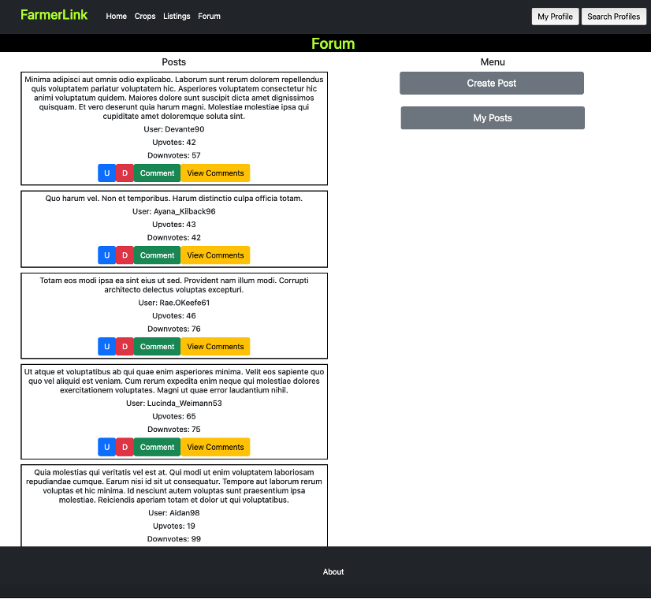
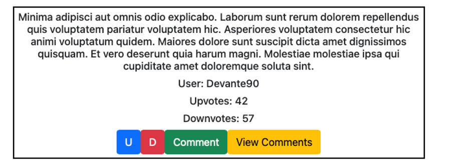
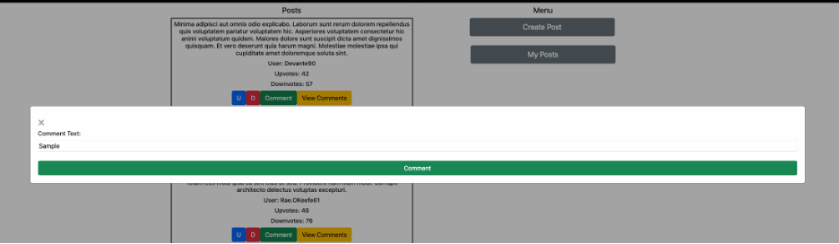
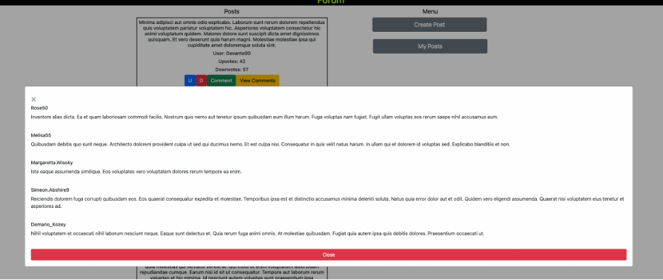
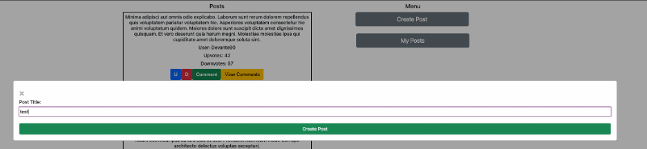
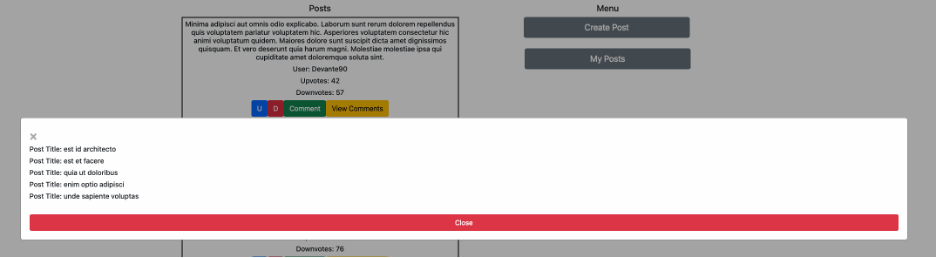
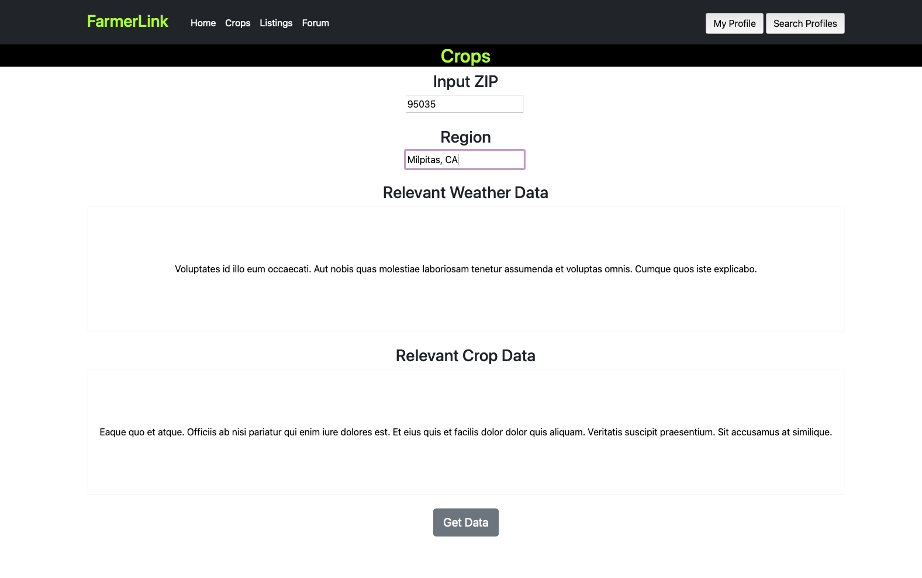

# Milestone 2: FamerLink

# URL: TODO

## Project Details

## Team name: Team Aleph

## Team members
* Zachary Tower, Github ztower-umass 
* Vidya Gopal, Github vidyago, nmn111, vidyago
* Siddharth Raju, Github sid2033

## Division of Labor
* All
    * Implement JS APIs for each teammate’s own page
    * Collect screenshots for milestone2.md
* Sid
    * Forum and Thread API
    * Crop query
* Vidya
    * User profile fetch
    * User search feature
* Zach
    * Listings
    * milestone2.md
    * setup.md
    * Heroku deployment

## API Description
farmerlink.com offers a number of CRUD APIs for a variety of end user services.  A full list of API endpoints can be found at the end of this document. The following is a brief overview of the major categories of endpoints for our site:

* The Forum page offers a CRUD API for maintaining threads. Users are able to view, comment, upvote, downvote, and create threads using the site API. Particularly, CRUD endpoints can be found at /forum/, such as /forum/upvote, /forum/downvote, etc.
* The User page offers a search API, which allows retrieval of particular user pages from a search bar. 
* The Crops page offers a CRUD API that queries a separate weather API which retrieves weather and crop data, and then combines all data on screen.
* The Listings page offers an API that allows the retrieval, display, and submission of listing pages. 

## API Endpoints Complete List
Endpoints with description:

'/forum/getPostData'

* GET request
* Used to retrieve all posts and their relevant data on page load/after adding a new post to refresh feed

'/forum/addComment'

* POST request
* Used to add a comment to a specific post
* POST data will have data such as the name of the comment and the user posting it

'/forum/upvote' AND '/forum/downvote'

* POST request
* Used to Upvoted/Downvote a specific post
* POST data will have the post’s information so it can be modified accordingly

'/forum/getCommentforPost'

* POST request
* Used to retrieve all comments for a specific post
* POST data will have the post’s information so it’s relevant comments can be retrieved

'/forum/makePost'

* POST request
* Used to add a post to the server made by the current user
* POST data will have all the post’s relevant information and the user making it

'/forum/myPosts'

* POST request
* Used to retrieve all posts made by the current user
* POST data will have the current user’s username so their respective posts can be retrieved

'/crops/getCropWeatherData'

* POST request
* Used to retrieve the relevant crop and weather data for the specified inputs
* POST data will take the zip code and/or region entered by the user 

'/user/getUserData'

* GET request
* Retrieves user data based off query data
* Returns JSON of user data, password, user firstname and lastname

'users/getUserDetail'

* POST request
* Retrieves details to user profile, such as DOB and email
* Returns 200 and JSON with appropriate fields

'users/addUserDetail'

* POST request
* Assigns details to user profile, such as DOB and email
* Returns status message (i.e. "success", "sorry, pick another user ID")

'listings/addListing'

* POST request
* Adds listing data to database
* Returns 200 message with name field

'listings/getListings'

* GET request
* returns a list of length n with JSON objects representing field data
* Involked with Refresh button

## Screenshots

Forum:

Main Forum Page:

Post Interface: U/D change the upvote and downvote counter. Comment opens the interface the post comments and view comments displays all comments related to the current post.

Interface to Post/View Comments. Post adds the comment to server and view retrieves all the relevant comments from the server.

Interface to create a new Post/view the current user’s posts. Create post adds the post to the global feed and My Posts retrieves all the current user’s posts from the server.

Crops:

