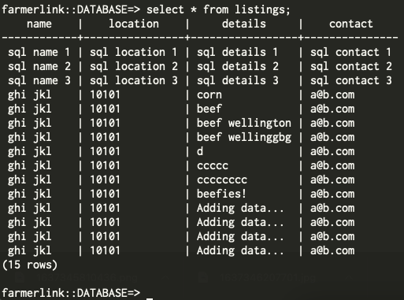
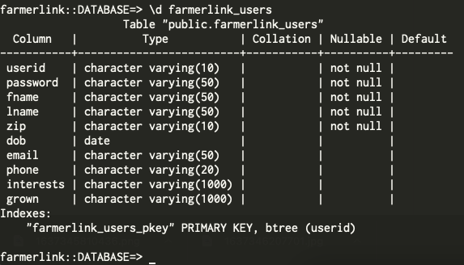

# FarmerLink, Milestone 3

## Listings Table

| Column       | Data Type | Description              |
|--------------|-----------|--------------------------|
| name         | String    | Name of user associated with listing (fname + lname)|
| location     | String    | Location data for user (currently ZIP code)      |
| details      | String    | Description of listing, pulled from "Details" box on page    |
| contact      | String    | Contact data, e.g. user email         |

## Post Table

- This table is used for storing data for all the posts in the forum and has 3 columns.
- The first column, "user_id" is used for storing the user who has made a particular post. This is stored as a string.
- The second column, "post_id" is used for storing the id of a particular post. This is stored as a string, typically in uuid4 format.
- The third column, "title" is used for storing the text contained in a particular post. This is stored as a string.

| Column       | Data Type | Description              |
|--------------|-----------|--------------------------|
| user_id      | String    | Name of user             |
| post_id      | String    | ID of post               |
| title        | String    | Text in post             |

## Comment Table

 - This table is used for storing data for all the comments in the forum and has 3 columns
 - The first column, "user_id" is used for storing the user who has made a particular comment. This is stored as a string.
 - The second column, "post_id" is used for storing the id of the post linked to a particular comment.This is stored as a string, typically in uuid4 format..
 - The third column, "comment_title" is used for storing the text contained in a particular comment. This is stored as a string.

| Column       | Data Type | Description              |
|--------------|-----------|--------------------------|
| user_id      | String    | Name of user             |
| post_id      | String    | ID of post for comment   |
| title        | String    | Text in comment          |

## Users Table

| Column       | Data Type | Description              |
|--------------|-----------|--------------------------|
| userid      | String    | profile username           |
| password      | String    | profile password   |
| fname        | String    | user first name      |
| lname        | String    | user surname         |
| zip        | String    | user ZIP code (or region equivalent)          |
| dob        | String    | date of birth in mm-dd-yyyy format          |
| email        | String    | user email          |
| phone        | String    | phone number          |
| interests        | String    | list of crops user is interested (but not currently) growing          |
| grown        | String    | list of crops user is currently growing          |

## Users Table Data
farmerlink_users_table with test data:

  userid  |    fname     |  lname  |  zip  |    dob     |         email         |    phone     |    interests    |      grown
----------+--------------+---------+-------+------------+-----------------------+--------------+-----------------+------------------
 bobama   | barack       | obama   | 02100 | 1962-01-01 | barack@whitehouse.gov | 978-522-2336 | grapes,cabbage  | grapes,livestock
 gbush    | george       | bush    | 02101 | 1942-01-01 | george@whitehouse.gov | 978-522-2336 | banana,wheat    | banana,peas
 dtrump   | donald       | trump   | 02101 | 1942-01-05 | donald@whitehouse.gov | 978-522-2336 | livestock,wheat | livestock,peas
 alincoln | abe          | lincoln | 02109 | 1842-01-05 | abe@whitehouse.gov    | 978-522-2336 | grapes,wheat    | livestock,citrus
 bclinton | William Jeff | Clinton | 02100 | 1942-01-01 | bill@whitehouse.gov   | 978-522-2335 | citrus,wheat    | banana,peas

## Division of Labor
 - Sid
    - Forum Page
        - Forum page UI integration
        - Forum page API/backend integration
        - Comment SQL Table
        - Post SQL Table
    - Crop Page
        - Crop page UI integration
        - Crop weather API/backend integration
        - Crop choice logic integration
    - 1/2 documentation (i.e. final.md, setup.md, milestone3.md)
 - Zach
    - Listings page
        - Listing UI integration
        - Database integration
    - Authentication refining
        - Authentication persistence implementation
        - Login-only page access implementation
    - 1/2 documentation (i.e. final.md, setup.md, milestone3.md)
 - Vidya
    - Postgres Heroku Add-on configuration
    - User Page
        - User authentication, backend + interface
        - User add, modify, backend+interface
        - Client-side valdation
    - Search Page
        - Search users based on search criteria
        - UI, backend, database integration
        - Shows search results
    - Storage of user details

## Scrapped Functionality
- Upvote/downvote